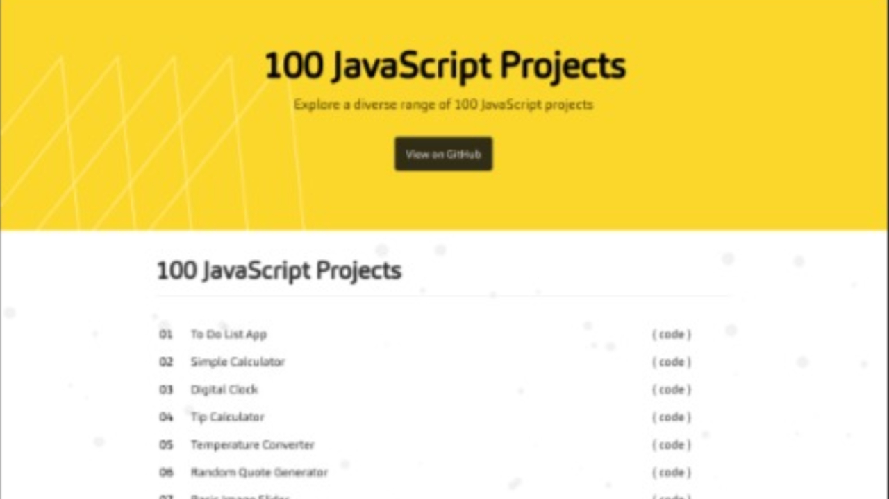

# [100 JavaScript Projects](https://github.com/pradipchaudhary/100-javascript-projects)

**A Collection of Vanilla JavaScript Projects**

This repository contains a collection of various Vanilla JavaScript projects. Each project is designed to showcase different aspects of JavaScript and its functionalities.

<!--  -->

<!--  -->

## Introduction

This repository contains 100 JavaScript projects, each focusing on specific concepts, libraries, or frameworks. Whether you're a beginner looking to practice your skills or an experienced developer seeking new challenges, you'll find a variety of projects to explore.

Feel free to explore each project in detail by navigating to their respective folders. Each project contains its own set of files and instructions on how to run or integrate them.

# JavaScript Projects

Here is a list of JavaScript projects:

| Index | Project Name                              | Code Link                                                                                            |
| ----- | ----------------------------------------- | ---------------------------------------------------------------------------------------------------- |
| 01    | To-Do List App                            | [Code](https://github.com/pradipchaudhary/100-javascript-projects/tree/master/01-To-Do%20List%20App) |
| 02    | Simple Calculator                         | [Code](https://github.com/pradipchaudhary/100-javascript-projects/simple-calculator)                 |
| 03    | Digital Clock                             | [Code](https://github.com/pradipchaudhary/100-javascript-projects/digital-clock)                     |
| 04    | Tip Calculator                            | [Code](https://github.com/pradipchaudhary/100-javascript-projects/tip-calculator)                    |
| 05    | Temperature Converter                     | [Code](https://github.com/pradipchaudhary/100-javascript-projects/temperature-converter)             |
| 06    | Random Quote Generator                    | [Code](https://github.com/pradipchaudhary/100-javascript-projects/random-quote-generator)            |
| 07    | Basic Image Slider                        | [Code](https://github.com/pradipchaudhary/100-javascript-projects/basic-image-slider)                |
| 08    | Countdown Timer                           | [Code](https://github.com/pradipchaudhary/100-javascript-projects/countdown-timer)                   |
| 09    | BMI Calculator                            | [Code](https://github.com/pradipchaudhary/100-javascript-projects/bmi-calculator)                    |
| 10    | Currency Converter                        | [Code](https://github.com/pradipchaudhary/100-javascript-projects/currency-converter)                |
| 11    | Weather App                               | [Code](https://github.com/pradipchaudhary/100-javascript-projects/weather-app)                       |
| 12    | Expense Tracker                           | [Code](https://github.com/pradipchaudhary/100-javascript-projects/expense-tracker)                   |
| 13    | Memory Game                               | [Code](https://github.com/pradipchaudhary/100-javascript-projects/memory-game)                       |
| 14    | Chat Application                          | [Code](https://github.com/pradipchaudhary/100-javascript-projects/chat-application)                  |
| 15    | Interactive Quiz                          | [Code](https://github.com/pradipchaudhary/100-javascript-projects/interactive-quiz)                  |
| 16    | Pomodoro Timer                            | [Code](https://github.com/pradipchaudhary/100-javascript-projects/pomodoro-timer)                    |
| 17    | Music Player                              | [Code](https://github.com/pradipchaudhary/100-javascript-projects/music-player)                      |
| 18    | Recipe App                                | [Code](https://github.com/pradipchaudhary/100-javascript-projects/recipe-app)                        |
| 19    | Car Rental Website                        | [Code](https://github.com/pradipchaudhary/100-javascript-projects/car-rental-website)                |
| 20    | Blogging Platform                         | [Code](https://github.com/pradipchaudhary/100-javascript-projects/blogging-platform)                 |
| 21    | Social Media Dashboard                    | [Code](https://github.com/pradipchaudhary/100-javascript-projects/social-media-dashboard)            |
| 22    | E-commerce Website                        | [Code](https://github.com/pradipchaudhary/100-javascript-projects/e-commerce-website)                |
| 23    | Real-time Chat Room                       | [Code](https://github.com/pradipchaudhary/100-javascript-projects/real-time-chat-room)               |
| 24    | Photo Editing Tool                        | [Code](https://github.com/pradipchaudhary/100-javascript-projects/photo-editing-tool)                |
| 25    | Cryptocurrency Tracker                    | [Code](https://github.com/pradipchaudhary/100-javascript-projects/cryptocurrency-tracker)            |
| 26    | Fitness Tracker                           | [Code](https://github.com/pradipchaudhary/100-javascript-projects/fitness-tracker)                   |
| 27    | Job Board Platform                        | [Code](https://github.com/pradipchaudhary/100-javascript-projects/job-board-platform)                |
| 28    | AI-powered Recommendation System          | [Code](https://github.com/pradipchaudhary/100-javascript-projects/ai-powered-recommendation-system)  |
| 29    | Augmented Reality Game                    | [Code](https://github.com/pradipchaudhary/100-javascript-projects/augmented-reality-game)            |
| 30    | Video Streaming Platform                  | [Code](https://github.com/pradipchaudhary/100-javascript-projects/video-streaming-platform)          |
| 31    | Google Maps Integration                   | [Code](https://github.com/pradipchaudhary/100-javascript-projects/google-maps-integration)           |
| 32    | Twitter/Facebook API Integration          | [Code](https://github.com/pradipchaudhary/100-javascript-projects/twitter-facebook-api-integration)  |
| 33    | YouTube Video Player                      | [Code](https://github.com/pradipchaudhary/100-javascript-projects/youtube-video-player)              |
| 34    | GitHub Profile Viewer                     | [Code](https://github.com/pradipchaudhary/100-javascript-projects/github-profile-viewer)             |
| 35    | Weather Forecast using OpenWeatherMap API | [Code](https://github.com/pradipchaudhary/100-javascript-projects/weather-forecast)                  |
| 36    | News Aggregator                           | [Code](https://github.com/pradipchaudhary/100-javascript-projects/news-aggregator)                   |
| 37    | Currency Exchange Rates using API         | [Code](https://github.com/pradipchaudhary/100-javascript-projects/currency-exchange-rates)           |
| 38    | NASA API for Astronomy Data               | [Code](https://github.com/pradipchaudhary/100-javascript-projects/nasa-api-astronomy-data)           |
| 39    | Random Joke Generator using Joke API      | [Code](https://github.com/pradipchaudhary/100-javascript-projects/random-joke-generator)             |
| 40    | Recipe Finder using Food API              | [Code](https://github.com/pradipchaudhary/100-javascript-projects/recipe-finder)                     |
| 41    | Drawing App                               | [Code](https://github.com/pradipchaudhary/100-javascript-projects/drawing-app)                       |
| 42    | Virtual Piano                             | [Code](https://github.com/pradipchaudhary/100-javascript-projects/virtual-piano)                     |
| 43    | Interactive Storytelling                  | [Code](https://github.com/pradipchaudhary/100-javascript-projects/interactive-storytelling)          |
| 44    | 3D Cube Puzzle                            | [Code](https://github.com/pradipchaudhary/100-javascript-projects/3d-cube-puzzle)                    |
| 45    | Text-based Adventure Game                 | [Code](https://github.com/pradipchaudhary/100-javascript-projects/text-adventure-game)               |
| 46    | Music Visualizer                          | [Code](https://github.com/pradipchaudhary/100-javascript-projects/music-visualizer)                  |
| 47    | Meme Generator                            | [Code](https://github.com/pradipchaudhary/100-javascript-projects/meme-generator)                    |
| 48    | Virtual Pet                               | [Code](https://github.com/pradipchaudhary/100-javascript-projects/virtual-pet)                       |
| 49    | Color Palette Generator                   | [Code](https://github.com/pradipchaudhary/100-javascript-projects/color-palette-generator)           |
| 50    | Emoji Translator                          | [Code](https://github.com/pradipchaudhary/100-javascript-projects/emoji-translator)                  |
| 51    | File Uploader                             | [Code](https://github.com/pradipchaudhary/100-javascript-projects/file-uploader)                     |
| 52    | Password Generator                        | [Code](https://github.com/pradipchaudhary/100-javascript-projects/password-generator)                |
| 53    | QR Code Generator/Scanner                 | [Code](https://github.com/pradipchaudhary/100-javascript-projects/qr-code-generator)                 |
| 54    | Unit Converter                            | [Code](https://github.com/pradipchaudhary/100-javascript-projects/unit-converter)                    |
| 55    | Markdown Editor                           | [Code](https://github.com/pradipchaudhary/100-javascript-projects/markdown-editor)                   |
| 56    | Voice Assistant                           | [Code](https://github.com/pradipchaudhary/100-javascript-projects/voice-assistant)                   |
| 57    | Note-taking App                           | [Code](https://github.com/pradipchaudhary/100-javascript-projects/note-taking-app)                   |
| 58    | Browser Extension                         | [Code](https://github.com/pradipchaudhary/100-javascript-projects/browser-extension)                 |
| 59    | Calendar/Planner                          | [Code](https://github.com/pradipchaudhary/100-javascript-projects/calendar-planner)                  |
| 60    | Clipboard Manager                         | [Code](https://github.com/pradipchaudhary/100-javascript-projects/clipboard-manager)                 |
| 61    | Interactive Charts (using D3.js)          | [Code](https://github.com/pradipchaudhary/100-javascript-projects/interactive-charts)                |
| 62    | Heatmap Generator                         | [Code](https://github.com/pradipchaudhary/100-javascript-projects/heatmap-generator)                 |
| 63    | Dashboard with Graphs and Metrics         | [Code](https://github.com/pradipchaudhary/100-javascript-projects/dashboard-graphs-metrics)          |
| 64    | Geographical Data Visualization           | [Code](https://github.com/pradipchaudhary/100-javascript-projects/geographical-data-viz)             |
| 65    | Network Traffic Analyzer                  | [Code](https://github.com/pradipchaudhary/100-javascript-projects/network-traffic-analyzer)          |
| 66    | Stock Market Tracker with Graphs          | [Code](https://github.com/pradipchaudhary/100-javascript-projects/stock-market-tracker)              |
| 67    | Polls and Survey Data Visualization       | [Code](https://github.com/pradipchaudhary/100-javascript-projects/polls-survey-data-viz)             |
| 68    | Visualizing COVID-19 Data                 | [Code](https://github.com/pradipchaudhary/100-javascript-projects/covid19-data-viz)                  |
| 69    | Population Density Map                    | [Code](https://github.com/pradipchaudhary/100-javascript-projects/population-density-map)            |
| 70    | Social Media Analytics Dashboard          | [Code](https://github.com/pradipchaudhary/100-javascript-projects/social-media-analytics)            |
| 71    | Tic Tac Toe                               | [Code](https://github.com/pradipchaudhary/100-javascript-projects/tic-tac-toe)                       |
| 72    | Snake Game                                | [Code](https://github.com/pradipchaudhary/100-javascript-projects/snake-game)                        |
| 73    | 2048                                      | [Code](https://github.com/pradipchaudhary/100-javascript-projects/2048)                              |
| 74    | Sudoku Solver                             | [Code](https://github.com/pradipchaudhary/100-javascript-projects/sudoku-solver)                     |
| 75    | Chess Game                                | [Code](https://github.com/pradipchaudhary/100-javascript-projects/chess-game)                        |
| 76    | Hangman                                   | [Code](https://github.com/pradipchaudhary/100-javascript-projects/hangman)                           |
| 77    | Memory Puzzle Game                        | [Code](https://github.com/pradipchaudhary/100-javascript-projects/memory-puzzle-game)                |
| 78    | Battleship                                | [Code](https://github.com/pradipchaudhary/100-javascript-projects/battleship)                        |
| 79    | Crossword Puzzle                          | [Code](https://github.com/pradipchaudhary/100-javascript-projects/crossword-puzzle)                  |
| 80    | Text-Based RPG                            | [Code](https://github.com/pradipchaudhary/100-javascript-projects/text-based-rpg)                    |
| 81    | Multiplayer Online Game                   | [Code](https://github.com/pradipchaudhary/100-javascript-projects/multiplayer-online-game)           |
| 82    | Virtual Reality Experience                | [Code](https://github.com/pradipchaudhary/100-javascript-projects/virtual-reality-experience)        |
| 83    | Augmented Reality App                     | [Code](https://github.com/pradipchaudhary/100-javascript-projects/augmented-reality-app)             |
| 84    | Web Scraping Tool                         | [Code](https://github.com/pradipchaudhary/100-javascript-projects/web-scraping-tool)                 |
| 85    | Chatbot                                   | [Code](https://github.com/pradipchaudhary/100-javascript-projects/chatbot)                           |
| 86    | Voice Recognition                         | [Code](https://github.com/pradipchaudhary/100-javascript-projects/voice-recognition)                 |
| 87    | Text-to-Speech                            | [Code](https://github.com/pradipchaudhary/100-javascript-projects/text-to-speech)                    |
| 88    | Speech-to-Text                            | [Code](https://github.com/pradipchaudhary/100-javascript-projects/speech-to-text)                    |
| 89    | Image Recognition                         | [Code](https://github.com/pradipchaudhary/100-javascript-projects/image-recognition)                 |
| 90    | Face Detection                            | [Code](https://github.com/pradipchaudhary/100-javascript-projects/face-detection)                    |
| 91    | Object Detection                          | [Code](https://github.com/pradipchaudhary/100-javascript-projects/object-detection)                  |
| 92    | Gesture Recognition                       | [Code](https://github.com/pradipchaudhary/100-javascript-projects/gesture-recognition)               |
| 93    | Emotion Detection                         | [Code](https://github.com/pradipchaudhary/100-javascript-projects/emotion-detection)                 |
| 94    | Handwriting Recognition                   | [Code](https://github.com/pradipchaudhary/100-javascript-projects/handwriting-recognition)           |
| 95    | Barcode/QR Code Scanner                   | [Code](https://github.com/pradipchaudhary/100-javascript-projects/barcode-qr-code-scanner)           |
| 96    | Color Picker                              | [Code](https://github.com/pradipchaudhary/100-javascript-projects/color-picker)                      |
| 97    | Image Editor                              | [Code](https://github.com/pradipchaudhary/100-javascript-projects/image-editor)                      |
| 98    | Video Editor                              | [Code](https://github.com/pradipchaudhary/100-javascript-projects/video-editor)                      |
| 99    | Audio Editor                              | [Code](https://github.com/pradipchaudhary/100-javascript-projects/audio-editor)                      |
| 100   | Virtual Machine Emulator                  | [Code](https://github.com/pradipchaudhary/100-javascript-projects/virtual-machine-emulator)          |

Feel free to explore and use these projects for learning and practice! If you have any questions or need further assistance, don't hesitate to ask.

---

## Contribution

Contributions to this collection of Vanilla JavaScript projects are welcome. If you have a new project or an improvement to an existing one, feel free to submit a pull request. Please follow the guidelines provided in the repository for contributing.

## License

This project is licensed under the [MIT License](LICENSE). You are free to use, modify, and distribute the code as per the terms of the license.

Happy coding!
