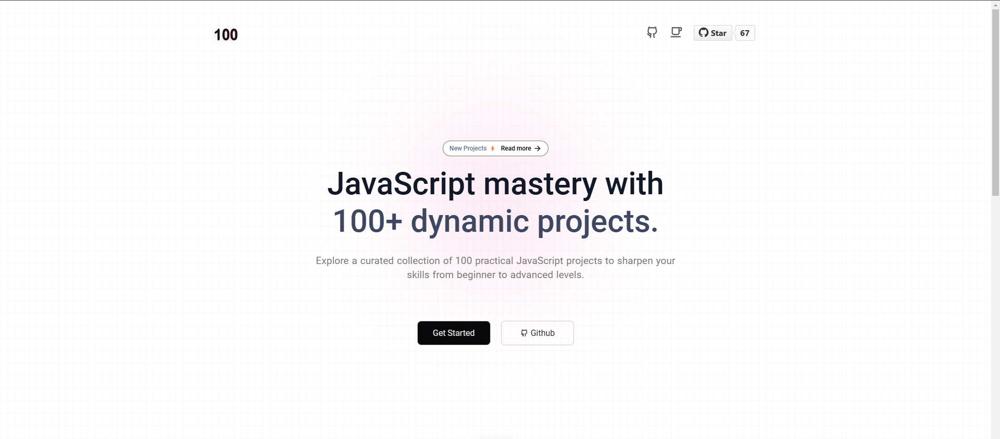

[](https://github.com/pradipchaudhary/100-js-projects/issues)
[](https://github.com/pradipchaudhary/100-js-projects/network)
[](https://github.com/pradipchaudhary/100-js-projects/stargazers)
[](https://github.com/pradipchaudhary/100-js-projects/blob/main/LICENSE)

Welcome to the **[100 JavaScript Projects](https://100jsproject.vercel.app/)** repository!



This curated collection is designed specifically for beginner to intermediate JavaScript developers eager to enhance their skills through hands-on projects. Whether you're just embarking on your JavaScript journey or aiming to deepen your expertise, this repository offers a diverse array of real-world projects to challenge and inspire you.

Explore, build, and master JavaScript with practical, engaging projects that cover various aspects of development. Each project is crafted to help you understand and apply fundamental concepts while pushing the boundaries of your coding capabilities.

**_Start building today and take your JavaScript skills to the next level!_**

---

## 📚 About

Inside this repository, you'll find **100 unique JavaScript projects** ranging from beginner-friendly exercises to more complex, real-world applications. Each project is thoughtfully crafted to focus on different aspects of JavaScript, helping you become proficient in:

-   🖼️ **DOM Manipulation**
-   🌟 **ES6+ Features**
-   🔗 **API Integration**
-   🧩 **Data Structures & Algorithms**
-   🎯 **Event Handling**
-   ⏳ **Asynchronous JavaScript** (Promises, Async/Await)
-   💾 **Browser Storage** (LocalStorage, SessionStorage)
-   ...and **so much more**!

Each project targets a specific JavaScript concept, so whether you're polishing up on async code or practicing DOM manipulation, there's something here for everyone.

---

## 💡 Why Build Projects?

Building projects is hands down the **best** way to learn JavaScript. Here’s why:

-   ✅ **Strengthen your knowledge** of core JavaScript concepts by applying them.
-   ✅ **Master real-world coding** by organizing, structuring, and debugging your own code.
-   ✅ **Boost your problem-solving skills** as you tackle project-specific challenges.
-   ✅ **Gain the confidence** to start building your own applications from scratch!

By working through these projects, you’re not just learning — you’re **creating**, **problem-solving**, and **growing** as a developer.

---

## 🛠️ How to Use

1. Clone this repository:

    ```bash
    git clone https://github.com/pradipchaudhary/100-js-projects.git
    ```

2. Navigate to the project folder:

    ```bash
    cd 100-js-projects
    ```

3. Each project is stored in its own directory with its own README file for instructions. Simply open the `index.html` file in a browser to view the project or open the project folder in your code editor to start coding.

---

## 📝 Project List

Here’s a quick overview of some of the projects included in this repository:

| #   | Project                | Link                                                                                              |
| --- | ---------------------- | ------------------------------------------------------------------------------------------------- |
| 01  | To-Do List App         | [View Code](https://github.com/pradipchaudhary/100-js-projects/tree/master/01-To-Do%20List%20App) |
| 02  | Simple Calculator      | [View Code](https://github.com/pradipchaudhary/100-js-projects/simple-calculator)                 |
| 03  | Digital Clock          | [View Code](https://github.com/pradipchaudhary/100-js-projects/digital-clock)                     |
| 04  | Tip Calculator         | [View Code](https://github.com/pradipchaudhary/100-js-projects/tip-calculator)                    |
| 05  | Temperature Converter  | [View Code](https://github.com/pradipchaudhary/100-js-projects/temperature-converter)             |
| 06  | Random Quote Generator | [View Code](https://github.com/pradipchaudhary/100-js-projects/random-quote-generator)            |
| ... | ...                    | ...                                                                                               |

Feel free to explore the [complete list of projects here](https://github.com/pradipchaudhary/100-js-projects).

---

## 👨‍💻 Technologies Used

-   **JavaScript** – Core language used in all projects
-   **HTML5** – For structuring web pages
-   **CSS3** – For basic styling (some projects)
-   **APIs** – Integrated in some projects for real-time data

---

## 🚀 Getting Started

To get started, simply pick a project from the list above, follow the instructions in its respective directory, and begin coding. Each project has a **README** with instructions, goals, and sometimes additional resources to guide you through the process.

---

## 🤝 Contributions

Contributions are welcome! If you'd like to contribute:

1. Fork the repository.
2. Create your feature branch: `git checkout -b feature/your-feature`.
3. Commit your changes: `git commit -m 'Add some feature'`.
4. Push to the branch: `git push origin feature/your-feature`.
5. Open a pull request.

---

## 📄 License

This repository is licensed under the MIT License. See the [LICENSE](LICENSE) file for more information.

---

## 📧 Contact

Feel free to reach out if you have any questions or feedback!

-   **GitHub**: [pradipchaudhary](https://github.com/pradipchaudhary)
-   **Email**: [chaudharypradip678@gmail.com](mailto:chaudharypradip678@gmail.com)

---

**Happy Coding! 🎉**
